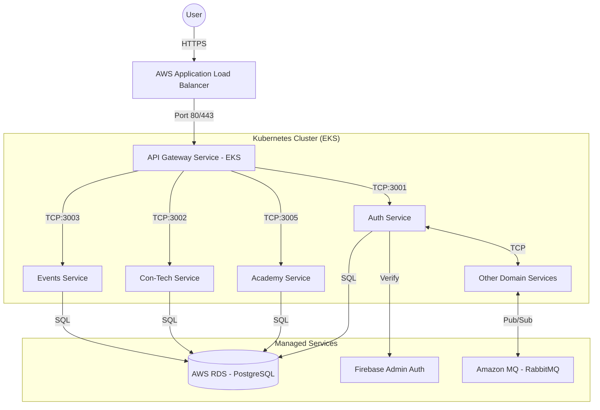

# AlikoHub: AWS Architecture & Deployment Strategy

This document outlines the strategic plan for deploying the AlikoHub microservices ecosystem on AWS using Kubernetes (EKS).

## 1. Architecture Overview

## 2. Infrastructure Components

### Compute: AWS EKS
- **Managed Kubernetes**: Handle scaling, self-healing, and high availability.
- **Node Groups**: EC2 instances (e.g., `t3.medium`) grouped in Private Subnets.

### Storage & Database: AWS RDS
- **PostgreSQL**: Separate databases or schemas for each microservice.
- **Multi-AZ**: Enable for production environments to ensure failover.

### Networking: VPC & Load Balancing
- **VPC**: 2 Public Subnets (for ALB) and 2 Private Subnets (for EKS nodes and RDS).
- **ALB (Application Load Balancer)**: Handles TLS termination and forwards traffic to the API Gateway.

### Registry: AWS ECR
- Private repositories for each service image (e.g., `alikohub/auth-service`).

---

## 3. Deployment Workflow

### Phase 1: Preparation
- **Dockerization**: Every service has a production Dockerfile.
- **Secrets Management**: Connect K8s to **AWS Secrets Manager** or use K8s Secrets for DB credentials and Firebase keys.

### Phase 2: CI/CD
1. **Build**: Triggered on push to `main`.
2. **Push**: Images tagged and pushed to **ECR**.
3. **Deploy**: Update K8s manifests (via `kubectl apply` or Helm) to use the new image tags.

### Phase 3: Scaling
- **Horizontal Pod Autoscaler (HPA)**: Scale microservices based on CPU/Memory usage.
- **Cluster Autoscaler**: Scale EC2 nodes in the EKS cluster.

## 4. Security
- **IAM Roles for Service Accounts (IRSA)**: Grant specific AWS permissions to K8s pods without using static credentials.
- **Security Groups**: Restrict traffic so only the ALB can reach the Gateway, and only microservices can reach RDS.
