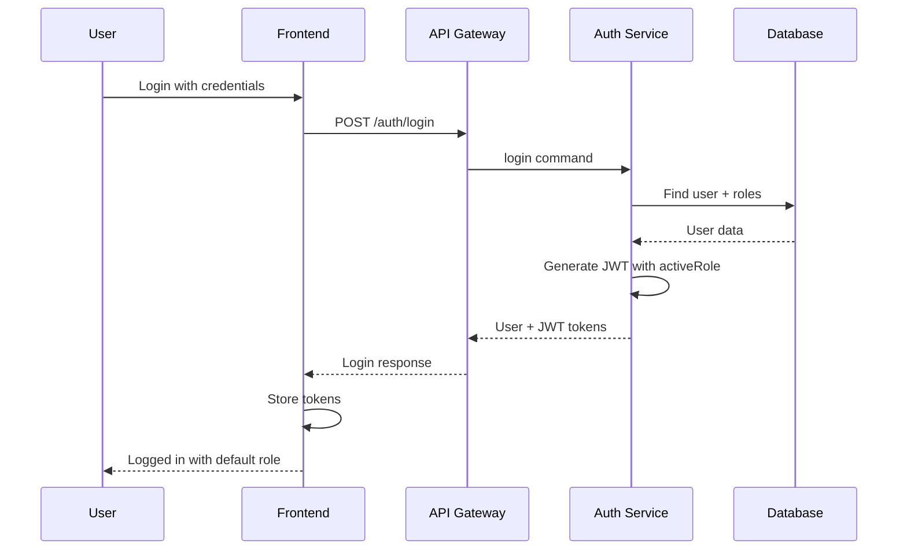
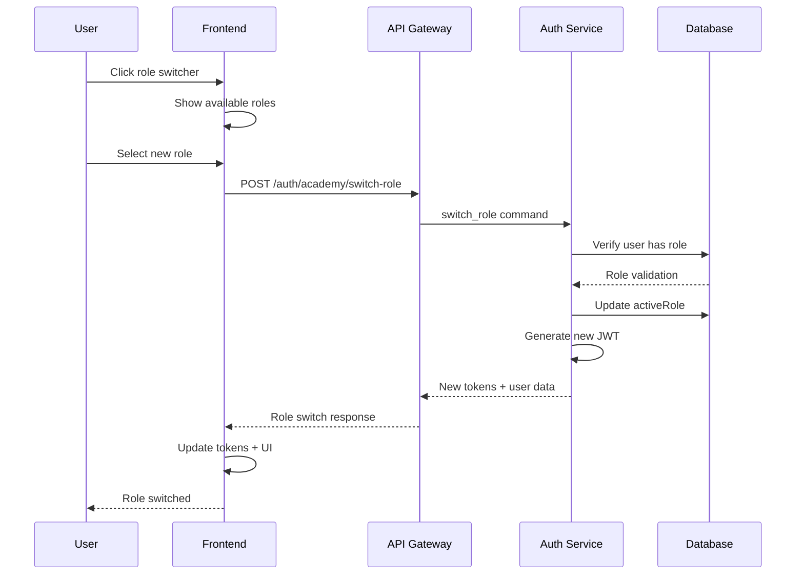
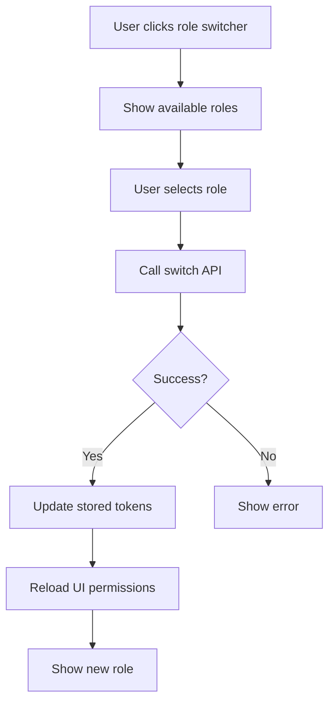
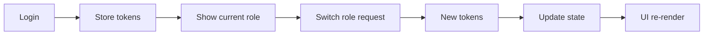
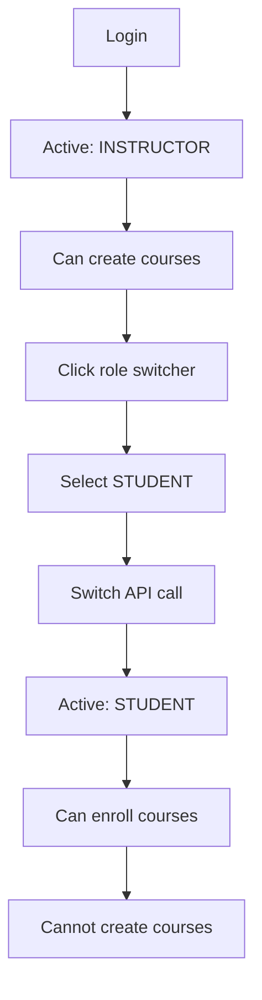
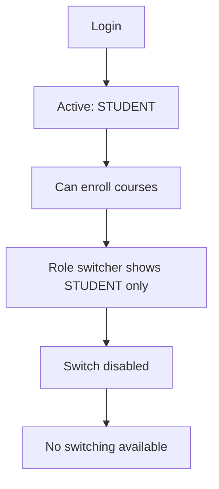
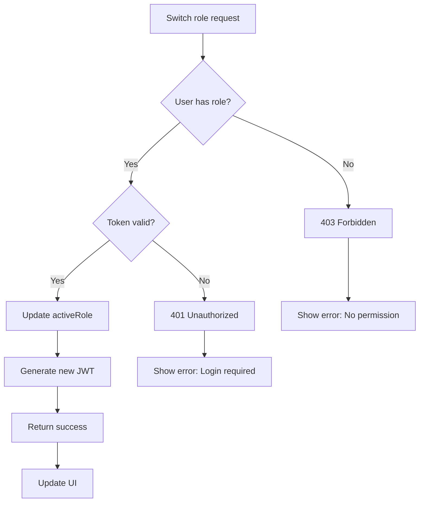
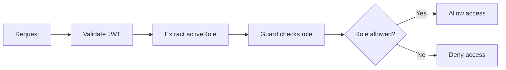

# Role Switching Workflow (Simple)

## Overview

Simple workflow for role switching from login to active role management.

## Login Flow



## Role Switching Flow



## JWT Token Structure

```json
{
  "uid": "user_firebase_id",
  "id": 5,
  "email": "user@example.com",
  "academyRole": "INSTRUCTOR",
  "academyActiveRole": "INSTRUCTOR",
  "academyStatus": "ACTIVE"
}
```

## API Endpoints

### Login
```
POST /auth/login
Response: { user, accessToken, refreshToken }
```

### Switch Role
```
POST /auth/academy/switch-role
Body: { "role": "STUDENT" }
Response: { message, activeRole, user, accessToken, refreshToken }
```

## Frontend Implementation

### Role Switcher Component



### State Management Flow



## User Scenarios

### Multi-Role User (Instructor + Student)



### Single Role User (Student Only)



## Error Handling



## Security Flow



## Quick Implementation Steps

1. **Login Phase**
   - User logs in normally
   - JWT includes `academyActiveRole`
   - Store tokens in frontend

2. **Role Switch Phase**
   - Show role switcher UI
   - Call `/auth/academy/switch-role`
   - Update stored tokens
   - Reload UI permissions

3. **Permission Checks**
   - Guards read `academyActiveRole` from JWT
   - Enforce access based on active role
   - UI components show/hide based on role

## Testing Checklist

- [ ] Login with different roles
- [ ] Role switcher shows correct options
- [ ] Switch role updates UI
- [ ] Permission guards work
- [ ] Error handling displays correctly
- [ ] Token refresh works after switch
