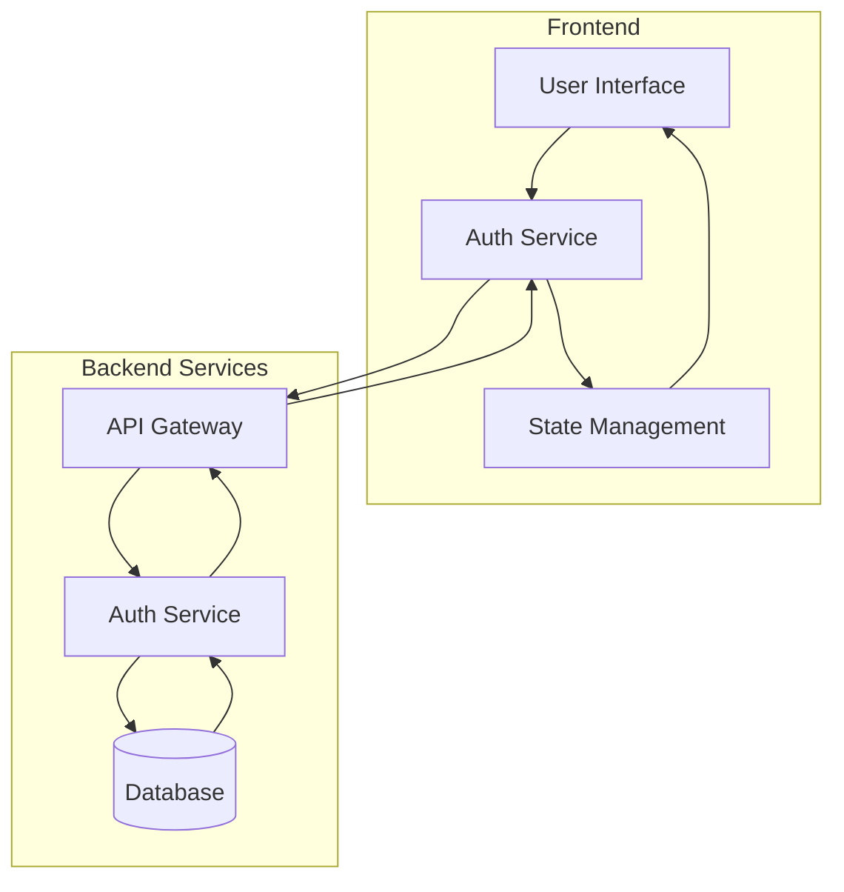
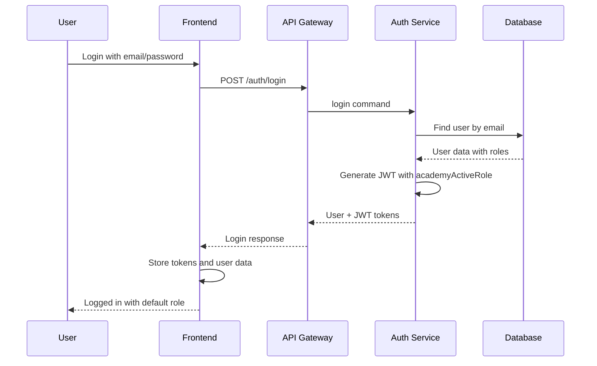
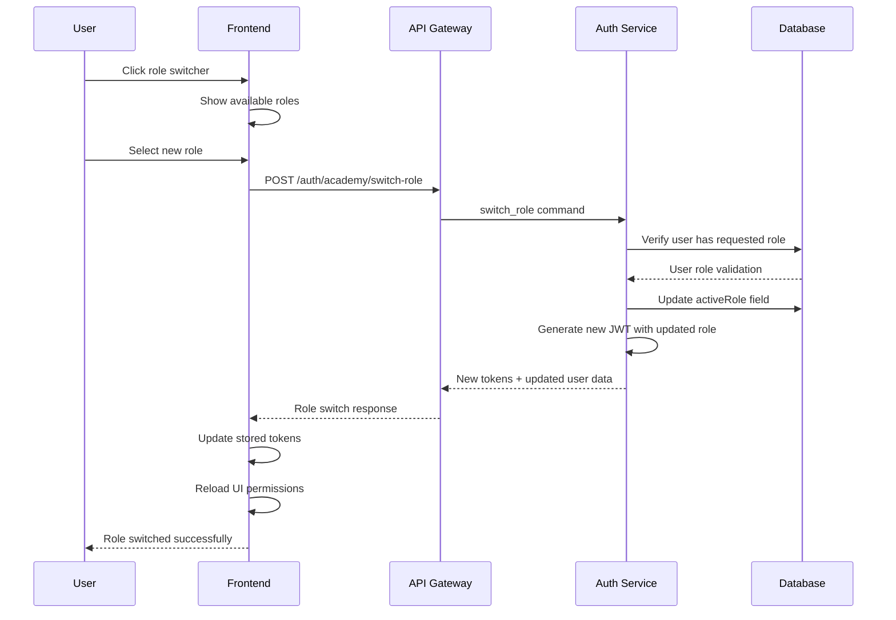

# Role Switching Workflow Documentation

## Overview

This document explains the complete role switching workflow in the AlikoHub system, from login to role switching, with detailed scenarios and diagrams for frontend integration.

## Architecture Overview



## User Login Flow

### Step 1: Initial Login



### Login Response Format

```json
{
  "user": {
    "id": 5,
    "email": "teacher@example.com",
    "firstname": "John",
    "lastname": "Doe",
    "globalRole": "USER",
    "status": "ACTIVE",
    "academyUser": {
      "role": "INSTRUCTOR",
      "activeRole": "INSTRUCTOR",
      "status": "ACTIVE"
    }
  },
  "accessToken": "eyJhbGciOiJIUzI1NiIs...",
  "refreshToken": "eyJhbGciOiJIUzI1NiIs...",
  "firebaseCustomToken": "eyJhbGciOiJIUzI1NiIs..."
}
```

## JWT Token Structure

The access token contains the following payload:

```json
{
  "uid": "mvullKLfmNTHZqQrGAWVY8OnHMD2",
  "id": 5,
  "email": "teacher@example.com",
  "firstname": "John",
  "lastname": "Doe",
  "globalRole": "USER",
  "status": "ACTIVE",
  "academyRole": "INSTRUCTOR",
  "academyActiveRole": "INSTRUCTOR",
  "academyStatus": "ACTIVE",
  "consultancyRole": "USER",
  "consultancyStatus": "ACTIVE",
  "contechRole": "USER",
  "contechStatus": "ACTIVE",
  "eventsRole": "USER",
  "eventsStatus": "ACTIVE",
  "iat": 1736656312,
  "exp": 1736659912
}
```

## Role Switching Flow

### Step 2: Role Switch Request



### Role Switch API Endpoint

**Endpoint:** `POST /auth/academy/switch-role`

**Headers:**
```
Authorization: Bearer <current_jwt_token>
Content-Type: application/json
```

**Request Body:**
```json
{
  "role": "STUDENT"
}
```

**Response:**
```json
{
  "message": "Role switched successfully",
  "activeRole": "STUDENT",
  "user": {
    "id": 5,
    "email": "teacher@example.com",
    "academyUser": {
      "role": "INSTRUCTOR",
      "activeRole": "STUDENT",
      "status": "ACTIVE"
    }
  },
  "accessToken": "eyJhbGciOiJIUzI1NiIs...",
  "refreshToken": "eyJhbGciOiJIUzI1NiIs..."
}
```

## Frontend Implementation Guide

### 1. Role Switcher Component

```javascript
// RoleSwitcher.jsx
import React, { useState, useEffect } from 'react';
import { useAuth } from './AuthContext';

const RoleSwitcher = () => {
  const { user, switchRole, loading } = useAuth();
  const [availableRoles, setAvailableRoles] = useState([]);

  useEffect(() => {
    // Determine available roles based on user's assigned roles
    const roles = [];
    if (user?.academyUser?.role === 'INSTRUCTOR') {
      roles.push('INSTRUCTOR');
    }
    if (user?.academyUser?.role === 'STUDENT') {
      roles.push('STUDENT');
    }
    // Add other role checks as needed
    setAvailableRoles(roles);
  }, [user]);

  const handleRoleSwitch = async (newRole) => {
    try {
      await switchRole(newRole);
      // UI will automatically update via context
    } catch (error) {
      console.error('Role switch failed:', error);
    }
  };

  return (
    <div className="role-switcher">
      <h3>Current Role: {user?.academyUser?.activeRole}</h3>
      <div className="available-roles">
        {availableRoles.map(role => (
          <button
            key={role}
            onClick={() => handleRoleSwitch(role)}
            disabled={role === user?.academyUser?.activeRole || loading}
            className={role === user?.academyUser?.activeRole ? 'active' : ''}
          >
            {role}
          </button>
        ))}
      </div>
    </div>
  );
};
```

### 2. Auth Context Hook

```javascript
// AuthContext.jsx
import React, { createContext, useContext, useReducer, useEffect } from 'react';

const AuthContext = createContext();

const authReducer = (state, action) => {
  switch (action.type) {
    case 'LOGIN_SUCCESS':
      return {
        ...state,
        user: action.payload.user,
        token: action.payload.accessToken,
        refreshToken: action.payload.refreshToken,
        isAuthenticated: true,
        loading: false
      };
    case 'ROLE_SWITCH_SUCCESS':
      return {
        ...state,
        user: action.payload.user,
        token: action.payload.accessToken,
        refreshToken: action.payload.refreshToken,
        loading: false
      };
    case 'LOGOUT':
      return {
        ...state,
        user: null,
        token: null,
        refreshToken: null,
        isAuthenticated: false,
        loading: false
      };
    case 'SET_LOADING':
      return {
        ...state,
        loading: action.payload
      };
    default:
      return state;
  }
};

export const AuthProvider = ({ children }) => {
  const [state, dispatch] = useReducer(authReducer, {
    user: null,
    token: localStorage.getItem('token'),
    refreshToken: localStorage.getItem('refreshToken'),
    isAuthenticated: false,
    loading: false
  });

  const switchRole = async (newRole) => {
    dispatch({ type: 'SET_LOADING', payload: true });
    
    try {
      const response = await fetch('/auth/academy/switch-role', {
        method: 'POST',
        headers: {
          'Content-Type': 'application/json',
          'Authorization': `Bearer ${state.token}`
        },
        body: JSON.stringify({ role: newRole })
      });

      if (!response.ok) {
        throw new Error('Role switch failed');
      }

      const data = await response.json();
      
      // Update localStorage
      localStorage.setItem('token', data.accessToken);
      localStorage.setItem('refreshToken', data.refreshToken);
      
      // Update context state
      dispatch({
        type: 'ROLE_SWITCH_SUCCESS',
        payload: data
      });

      return data;
    } catch (error) {
      dispatch({ type: 'SET_LOADING', payload: false });
      throw error;
    }
  };

  return (
    <AuthContext.Provider value={{ ...state, switchRole }}>
      {children}
    </AuthContext.Provider>
  );
};

export const useAuth = () => {
  const context = useContext(AuthContext);
  if (!context) {
    throw new Error('useAuth must be used within an AuthProvider');
  }
  return context;
};
```

### 3. Permission-Based Component Rendering

```javascript
// PermissionGuard.jsx
import React from 'react';
import { useAuth } from './AuthContext';

const PermissionGuard = ({ requiredRole, children }) => {
  const { user } = useAuth();
  
  const currentRole = user?.academyUser?.activeRole;
  const hasPermission = currentRole === requiredRole;

  if (!hasPermission) {
    return <div>Access denied: {requiredRole} role required</div>;
  }

  return children;
};

// Usage example
const InstructorOnlyComponent = () => (
  <PermissionGuard requiredRole="INSTRUCTOR">
    <div>This content is only visible to instructors</div>
  </PermissionGuard>
);
```

## Complete User Scenarios

### Scenario 1: Teacher with Multiple Roles

**User Profile:**
- Assigned roles: INSTRUCTOR, STUDENT
- Default active role: INSTRUCTOR

**Flow:**
1. User logs in → JWT contains `academyActiveRole: "INSTRUCTOR"`
2. User sees instructor dashboard and can create courses
3. User clicks role switcher → Sees "INSTRUCTOR" and "STUDENT" options
4. User selects "STUDENT" → Role switch API called
5. New JWT issued with `academyActiveRole: "STUDENT"`
6. UI reloads → User now sees student dashboard
7. User can enroll in courses but cannot create them

### Scenario 2: Single Role User

**User Profile:**
- Assigned role: STUDENT only
- Active role: STUDENT

**Flow:**
1. User logs in → JWT contains `academyActiveRole: "STUDENT"`
2. User sees student dashboard
3. Role switcher shows only "STUDENT" (disabled)
4. No role switching available

## Error Handling

### Common Error Responses

**403 Forbidden:**
```json
{
  "statusCode": 403,
  "message": "User does not have STUDENT role",
  "error": "Forbidden"
}
```

**401 Unauthorized:**
```json
{
  "statusCode": 401,
  "message": "Invalid or expired token",
  "error": "Unauthorized"
}
```

### Frontend Error Handling

```javascript
const handleRoleSwitch = async (newRole) => {
  try {
    await switchRole(newRole);
    // Show success message
    showNotification('Role switched successfully!', 'success');
  } catch (error) {
    if (error.response?.status === 403) {
      showNotification('You do not have permission to switch to this role', 'error');
    } else if (error.response?.status === 401) {
      showNotification('Session expired. Please login again.', 'error');
      // Redirect to login
      logout();
    } else {
      showNotification('Failed to switch role. Please try again.', 'error');
    }
  }
};
```

## Security Considerations

1. **Token Validation:** Backend validates that user has the requested role before switching
2. **JWT Expiration:** New tokens issued with same expiration rules
3. **Role Verification:** Guards check `academyActiveRole` from JWT for all protected endpoints
4. **Audit Trail:** All role switches are logged in the backend

## Testing Checklist

- [ ] User can login with assigned roles
- [ ] Role switcher shows correct available roles
- [ ] Role switch updates JWT and UI
- [ ] Permission guards respect new active role
- [ ] Error handling works for unauthorized requests
- [ ] Token refresh works after role switch
- [ ] Multiple role users can switch between all assigned roles
- [ ] Single role users cannot switch roles

## API Reference

### Get User Status
```
GET /auth/academy/user-status/:userId
```

### Switch Role
```
POST /auth/academy/switch-role
```

### Get Teacher Applications
```
GET /auth/academy/teacher-applications
```

This documentation provides a complete guide for implementing role switching functionality on the frontend side, with detailed workflows, code examples, and error handling strategies.
