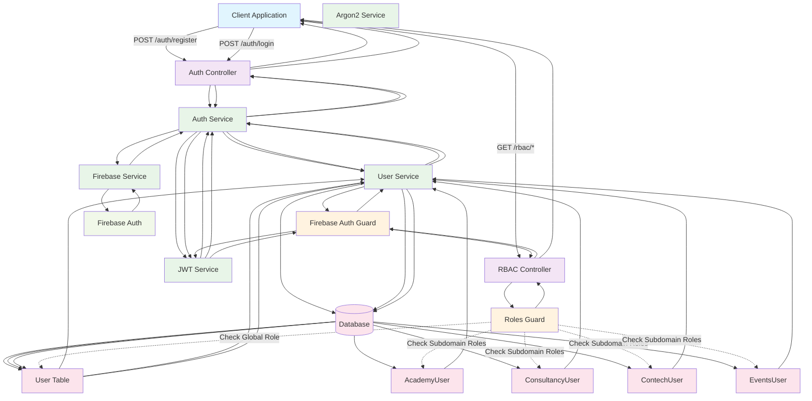
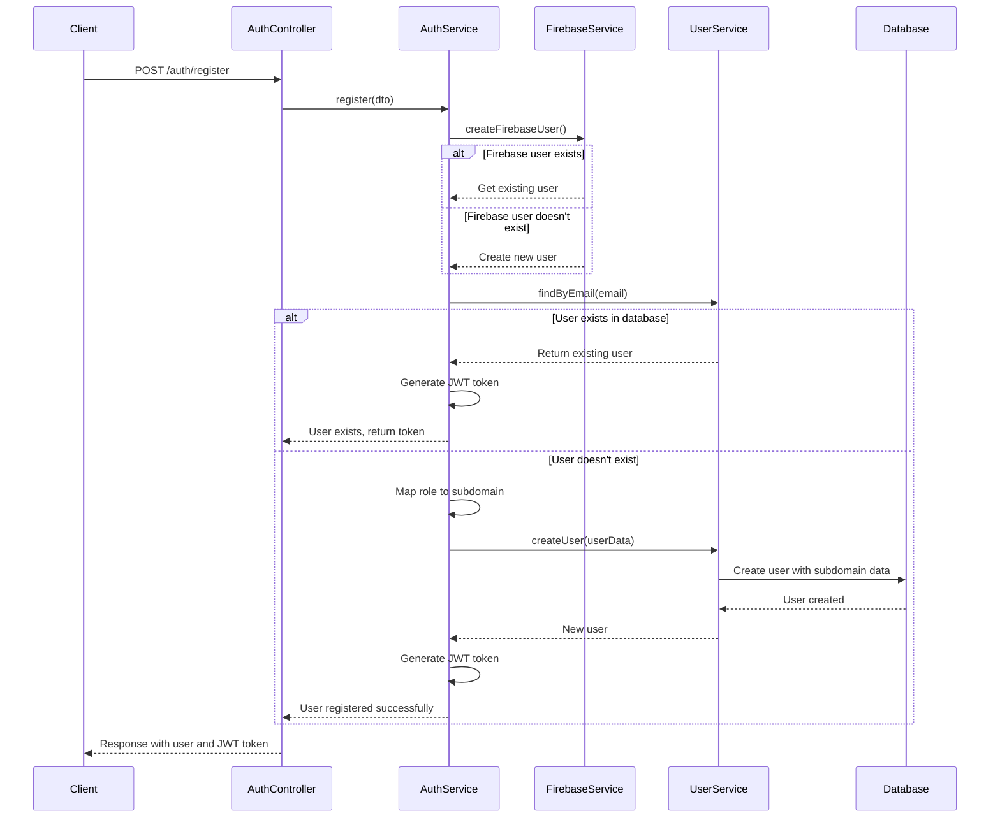
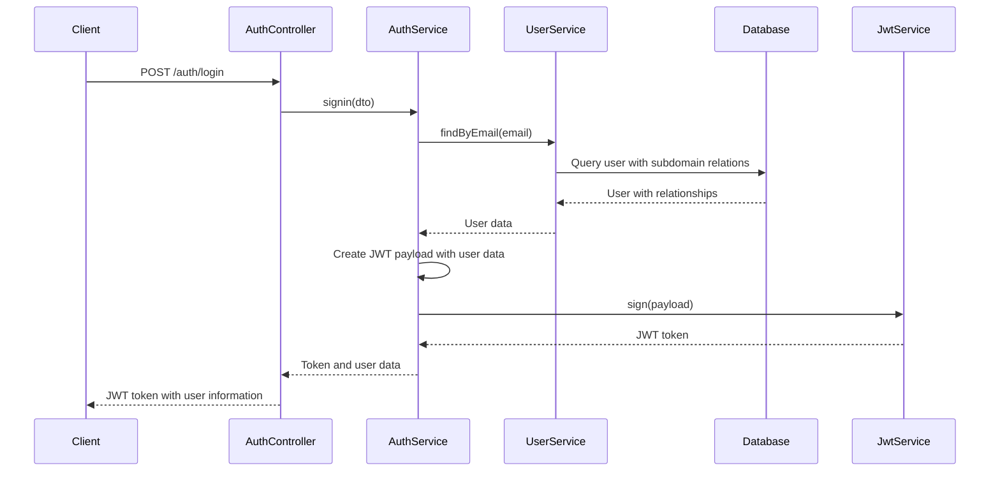
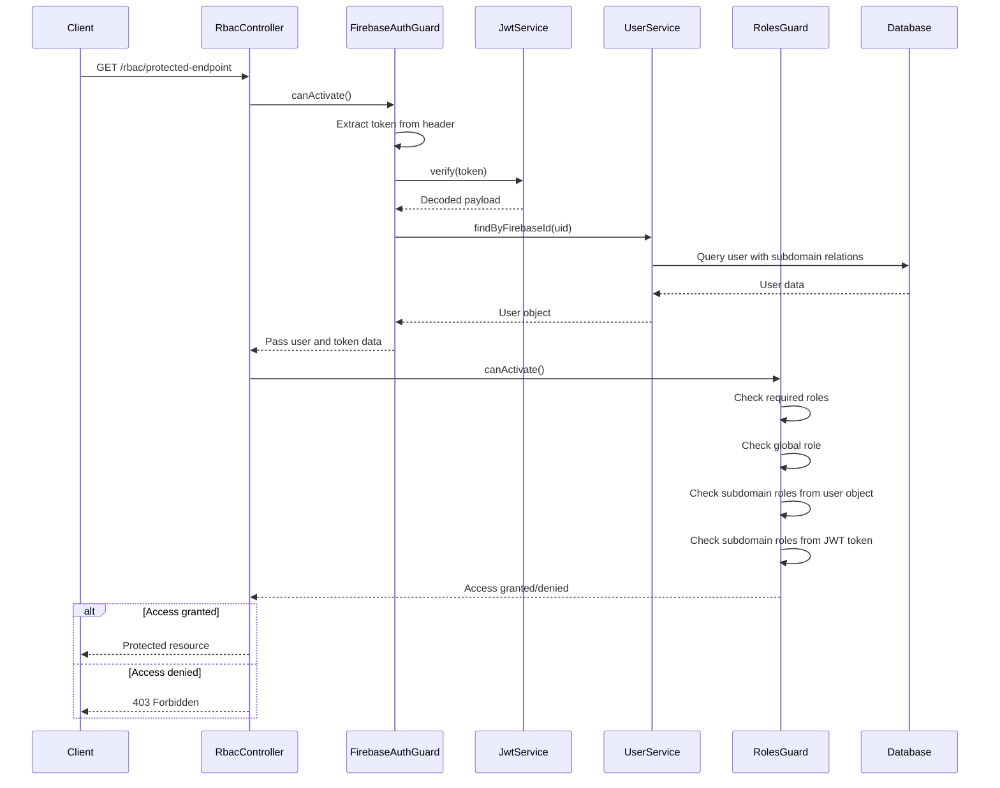

# AlikoHub Auth Service Workflow Design

## Overview

The AlikoHub Authentication Service provides centralized user authentication and role-based access control (RBAC) across multiple subdomains. This document outlines the complete workflow design, including user registration, authentication, token management, and subdomain role enforcement.

## Complete System Workflow Diagram



## Architecture Components

### Core Services
- **AuthService**: Main authentication logic
- **UserService**: User data management and relationships
- **FirebaseService**: Firebase user management
- **JwtService**: JWT token generation and validation
- **Argon2Service**: Password hashing
- **RolesGuard**: RBAC enforcement
- **FirebaseAuthGuard**: Token validation

### Database Schema
- **User**: Core user entity with global roles
- **AcademyUser**: Academy-specific user data
- **ConsultancyUser**: Consultancy-specific user data
- **ContechUser**: Contech-specific user data
- **EventsUser**: Events-specific user data

## User Registration Workflow



### Role Mapping Logic

The registration process maps global role enums to specific subdomain database roles:

| Global Role | Subdomain | Database Role | User Table |
|-------------|-----------|---------------|------------|
| ACADEMY_ADMIN | Academy | ACADEMY_ADMIN | academyUser |
| ACADEMY_INSTRUCTOR | Academy | INSTRUCTOR | academyUser |
| ACADEMY_STUDENT | Academy | STUDENT | academyUser |
| CONSULTANCY_ADVISOR | Consultancy | ADVISOR | consultancyUser |
| CONSULTANCY_MANAGER | Consultancy | CONSULTANCY_ADMIN | consultancyUser |
| CONSULTANCY_CLIENT | Consultancy | STUDENT | consultancyUser |
| CONTECH_DEVELOPER | Contech | CONTRACTOR | contechUser |
| CONTECH_DESIGNER | Contech | CONTRACTOR | contechUser |
| CONTECH_PROJECT_MANAGER | Contech | PROJECT_MANAGER | contechUser |
| EVENTS_ORGANIZER | Events | ORGANIZER | eventsUser |
| EVENTS_PARTICIPANT | Events | ATTENDEE | eventsUser |
| EVENTS_SPONSOR | Events | SPONSOR | eventsUser |

## User Authentication Workflow



### JWT Token Structure

The JWT token contains comprehensive user data:

```json
{
  "uid": "firebase_uid",
  "id": 123,
  "email": "user@example.com",
  "firstname": "John",
  "lastname": "Doe",
  "globalRole": "USER",
  "status": "ACTIVE",
  "academyRole": "ACADEMY_ADMIN",
  "consultancyRole": "ADVISOR",
  "contechRole": "PROJECT_MANAGER",
  "eventsRole": "ORGANIZER",
  "iat": 1234567890,
  "exp": 1234571490
}
```

## RBAC Enforcement Workflow



### Role Checking Logic

The RolesGuard implements a hierarchical role checking system:

1. **Global Role Check**: First checks if the user's global role matches any required roles
2. **Database Relationship Check**: Checks subdomain roles from database relationships
3. **JWT Token Check**: Falls back to JWT token data if relationships not loaded

## Subdomain Interaction Patterns

### 1. Academy Subdomain
- **Roles**: ACADEMY_ADMIN, ACADEMY_INSTRUCTOR, ACADEMY_STUDENT
- **Database Mapping**: academyUser table with AcademyRole enum
- **Access Patterns**: Course management, student enrollment, instructor assignments

### 2. Consultancy Subdomain
- **Roles**: CONSULTANCY_ADVISOR, CONSULTANCY_MANAGER, CONSULTANCY_CLIENT
- **Database Mapping**: consultancyUser table with ConsultancyRole enum
- **Access Patterns**: Client management, advisory services, partnership coordination

### 3. Contech Subdomain
- **Roles**: CONTECH_DEVELOPER, CONTECH_DESIGNER, CONTECH_PROJECT_MANAGER
- **Database Mapping**: contechUser table with ContechRole enum
- **Access Patterns**: Project development, design workflows, stakeholder management

### 4. Events Subdomain
- **Roles**: EVENTS_ORGANIZER, EVENTS_PARTICIPANT, EVENTS_SPONSOR
- **Database Mapping**: eventsUser table with EventsRole enum
- **Access Patterns**: Event management, participation tracking, sponsor coordination

## Error Handling Strategies

### Registration Errors
- **Firebase User Exists**: Retrieve existing Firebase user and proceed
- **Database Unique Constraint**: Return "User already exists" with existing token
- **Invalid Role Mapping**: Throw validation error with role requirements
- **Password Hashing Failure**: Return generic error for security

### Authentication Errors
- **User Not Found**: Return "Invalid credentials" for security
- **Password Mismatch**: Return "Invalid credentials" for security
- **Token Generation Failure**: Log error and return server error

### Authorization Errors
- **No Token Provided**: Return 401 Unauthorized
- **Invalid Token**: Return 401 Unauthorized
- **Insufficient Permissions**: Return 403 Forbidden
- **User Not Found**: Return 401 Unauthorized

## Security Considerations

### Token Security
- JWT tokens signed with configurable secret key
- Token expiration set to 1 hour
- User data embedded in token to reduce database queries
- Subdomain roles included for immediate access control

### Password Security
- Argon2 hashing algorithm for password storage
- Password validation during registration
- Optional password for OAuth-based registration

### Data Access Patterns
- Database queries include subdomain relationships for efficiency
- JWT token data used as fallback for role checking
- Firebase UID used as primary user identifier

## API Endpoints

### Authentication Endpoints
- `POST /auth/register` - User registration with role assignment
- `POST /auth/login` - User authentication with JWT token
- `POST /auth/login/google` - Google SSO integration

### RBAC Protected Endpoints
- `GET /rbac/admin` - Admin-only resource
- `GET /rbac/user` - User-level resource
- `GET /rbac/academy-admin` - Academy admin resource
- `GET /rbac/academy-instructor` - Academy instructor resource
- `GET /rbac/academy-student` - Academy student resource
- `GET /rbac/consultancy-advisor` - Consultancy advisor resource
- `GET /rbac/consultancy-manager` - Consultancy manager resource
- `GET /rbac/consultancy-client` - Consultancy client resource
- `GET /rbac/contech-developer` - Contech developer resource
- `GET /rbac/contech-designer` - Contech designer resource
- `GET /rbac/contech-project-manager` - Contech project manager resource
- `GET /rbac/events-organizer` - Events organizer resource
- `GET /rbac/events-participant` - Events participant resource
- `GET /rbac/events-sponsor` - Events sponsor resource

## Performance Optimizations

### Database Optimization
- Nested includes for subdomain relationships
- Email-based indexing for fast user lookup
- Firebase UID indexing for token validation

### Token Optimization
- User data embedded in JWT payload
- Subdomain roles included for immediate access
- Reduced database queries for authorization

### Caching Strategies
- User data caching for frequent access
- Role mapping cache for performance
- JWT token validation caching

## Future Enhancements

### Planned Features
- Multi-factor authentication support
- Role hierarchy and inheritance
- Dynamic role assignment
- Audit logging for security events
- Token refresh mechanism
- OAuth provider expansion

### Scalability Considerations
- Horizontal scaling support
- Database sharding readiness
- Load balancing compatibility
- Microservice decomposition

## Conclusion

The AlikoHub Auth Service provides a robust, scalable authentication and authorization system with comprehensive subdomain support. The workflow design ensures secure user management, efficient role-based access control, and seamless integration across multiple business domains while maintaining high performance and security standards.
